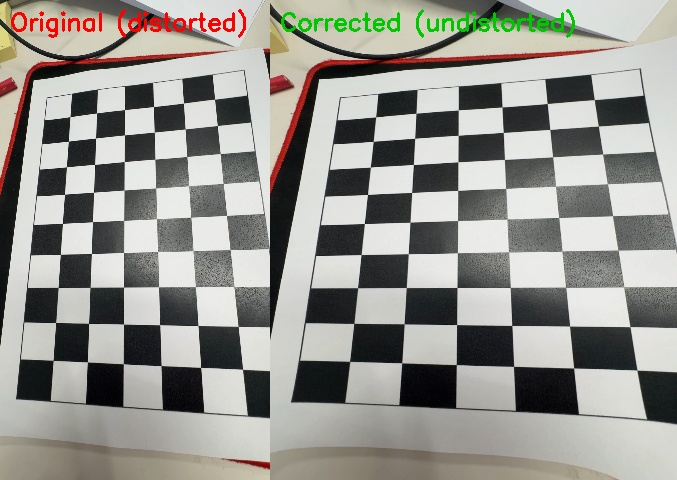

# lens_curve_calibration

A camera calibration and lens distortion correction tool built with OpenCV. Point it at a chessboard video, and it computes your camera's intrinsic parameters and corrects lens distortion in real time.

## Demo



## Features

- Automatic chessboard corner detection from a video file
- Camera intrinsic parameter estimation (focal length, principal point)
- Lens distortion correction using calibration results
- Side-by-side before/after comparison view
- Exports a comparison image ready for documentation

## Requirements

- Python 3.x
- OpenCV
- NumPy

Install dependencies:

```bash
pip install opencv-python numpy
```

## Usage

### Step 1 — Camera calibration

Record a video of a printed chessboard from many different angles, then run:

```bash
python camera_calibration.py
```

Edit the settings at the top of the file to match your setup:

```python
VIDEO_FILE  = 'chessboard.mov'  # your video file
BOARD_SIZE  = (6, 9)            # inner corners of your chessboard
FRAME_SKIP  = 15                # sample every N frames
```

This produces a `calibration.npz` file with the camera parameters.

### Step 2 — Lens distortion correction

```bash
python distortion_correction.py
```

Edit the input source at the top:

```python
INPUT_SOURCE = 'chessboard.mov'  # or 0 for live webcam
```

Press `s` to save a comparison image, `q` to quit.

## Camera Calibration Results

Calibrated using an iPhone camera with the ultra-wide lens.

| Parameter | Value |
|-----------|-------|
| fx | 1663.8452 |
| fy | 1668.8951 |
| cx | 1070.2094 |
| cy | 1935.1610 |
| k1 | -0.018683 |
| k2 | 0.056180 |
| p1 | -0.001160 |
| p2 | 0.002125 |
| k3 | -0.054230 |
| RMSE | 1.4575 px |

`fx` and `fy` are the focal lengths in pixels. `cx` and `cy` are the principal point (optical center). `k1`, `k2`, `k3` are radial distortion coefficients and `p1`, `p2` are tangential distortion coefficients. The RMSE of 1.4575 px represents the average re-projection error — values below 2.0 px are generally considered a good calibration.
